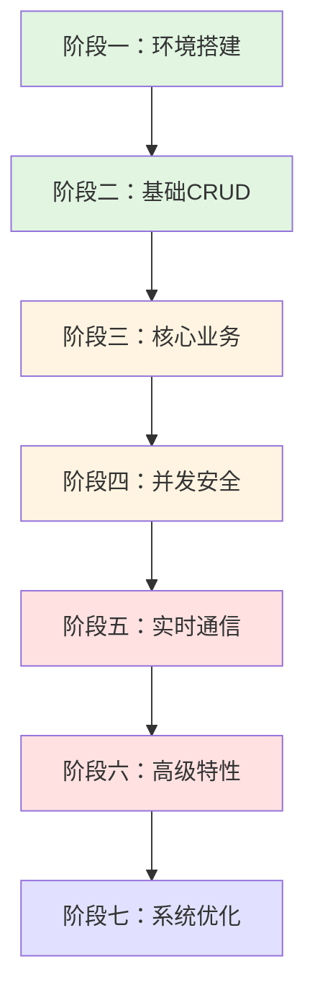

# 🎯 电子拍卖系统 - 从零到精通学习方案

## 📚 学习路径总览



## 🔑 阶段一：环境搭建与项目启动（1-2天）

### 🎯 学习目标
- 掌握项目启动流程
- 理解项目整体结构
- 熟悉开发环境配置

### 📋 关键步骤

#### 1.1 环境准备
```bash
# 检查Java版本
java -version  # 需要JDK 17+

# 检查Maven版本  
mvn -version   # 需要Maven 3.8+

# 检查MySQL服务
mysql --version

# 检查Redis服务
redis-cli ping
```

#### 1.2 数据库初始化
```bash
# 创建数据库和表结构
mysql -u root -p < src/main/resources/schema.sql

# 验证表创建
mysql -u root -p auction -e "SHOW TABLES;"
```

#### 1.3 配置文件修改
**关键文件：** `src/main/resources/application-dev.yml`

```yaml
spring:
  datasource:
    url: jdbc:mysql://localhost:3306/auction
    username: root        # 修改为你的MySQL用户名
    password: your_password  # 修改为你的MySQL密码
    
  data:
    redis:
      host: localhost     # 确保Redis正在运行
      port: 6379
```

#### 1.4 项目启动验证
```bash
# 启动项目
mvn spring-boot:run

# 健康检查
curl http://localhost:8080/api/test/ping

# 预期返回
{
  "code": 200,
  "data": {
    "status": "ok",
    "message": "直播竞拍系统运行中"
  }
}
```

### 🔍 重要知识点
1. **Spring Boot启动流程**：理解`@SpringBootApplication`注解的作用
2. **配置文件优先级**：`application.yml` vs `application-dev.yml`
3. **依赖注入**：`@Autowired` vs 构造函数注入
4. **项目结构**：理解DDD（领域驱动设计）分层架构

### ⚠️ 常见问题
| 问题 | 解决方案 |
|------|----------|
| 端口8080被占用 | `taskkill //F //PID <进程ID>` 或修改配置文件端口 |
| 数据库连接失败 | 检查MySQL服务是否启动，用户名密码是否正确 |
| Redis连接失败 | 确保Redis服务正在运行：`redis-server` |

---

## 📦 阶段二：基础CRUD与数据模型（2-3天）

### 🎯 学习目标
- 理解领域模型设计
- 掌握基础增删改查操作
- 熟悉MyBatis-Plus使用

### 📋 学习顺序

#### 2.1 商品管理（最简单的CRUD）
**文件路径：** `src/main/java/com/auction/api/controller/ProductController.java`

```java
// 1. 创建商品
POST /api/products
{
  "name": "翡翠手镯",
  "imageUrl": "https://...",
  "description": "天然A货翡翠",
  "category": "珠宝"
}

// 2. 查询商品详情
GET /api/products/{id}

// 3. 查询所有商品
GET /api/products
```

**关键知识点：**
- **实体类设计**：`Product.java` - 商品的基本属性
- **Repository模式**：`ProductRepository.java` - 数据访问层
- **DTO转换**：`CreateProductRequest` → `Product` → `ProductResponse`
- **验证注解**：`@Valid`、`@NotNull`、`@Size`等

#### 2.2 用户管理
**文件路径：** `src/main/java/com/auction/repository/UserRepository.java`

**关键知识点：**
- **基础查询方法**：`findById()`、`findAll()`、`save()`
- **自定义查询**：`findByUsername()`、`countByUserId()`
- **MyBatis-Plus注解**：`@TableName`、`@TableId`

#### 2.3 订单基础查询
**文件路径：** `src/main/java/com/auction/api/controller/OrderController.java`

```java
// 查询用户的所有订单
GET /api/orders/user/{userId}

// 查询订单详情（包含关联信息）
GET /api/orders/{orderId}
```

**关键知识点：**
- **关联查询**：订单 → 竞拍 → 商品
- **数据聚合**：如何在订单中嵌入竞拍和商品信息
- **枚举使用**：`OrderStatus.PENDING_PAYMENT`等

### 🎯 业务闭环验证
```
创建商品 → 查询商品 → 修改商品 → 删除商品
```

### 💡 关键要点
1. **领域模型设计**：理解为什么商品、用户、订单要分开设计
2. **数据库映射**：实体类字段如何映射到数据库表
3. **Repository职责**：数据访问层只负责CRUD，不包含业务逻辑
4. **Controller职责**：接口层只负责参数验证和调用Service，不包含业务逻辑

---

## 🎪 阶段三：竞拍核心业务（3-4天）

### 🎯 学习目标
- 理解竞拍业务流程
- 掌握状态机设计思想
- 熟悉竞拍规则实现

### 📋 学习顺序

#### 3.1 竞拍活动生命周期
**文件路径：** `src/main/java/com/auction/domain/entity/Auction.java`

```java
// 竞拍状态流转
PENDING → ACTIVE → COMPLETED
         ↘ CANCELLED
```

**关键知识点：**
- **状态机设计**：竞拍从"待开始"到"进行中"到"已结束"的严格流转
- **时间管理**：`startTime`、`endTime`、`originalEndTime`的区别
- **价格体系**：`startPrice`（起拍价）→ `currentPrice`（当前价）→ `finalPrice`（成交价）

#### 3.2 创建竞拍活动
**API接口：**
```java
POST /api/auctions
{
  "productId": 1,
  "title": "翡翠手镯拍卖",
  "startPrice": 1000,
  "bidIncrement": 100,    // 每次加价幅度
  "maxPrice": 10000,      // 封顶价
  "delaySeconds": 15,     // 自动延时时长
  "startTime": "2026-05-28T10:00:00",
  "endTime": "2026-05-28T12:00:00"
}
```

**业务逻辑分析：**
1. **商品存在性验证**：`productRepository.existsById()`
2. **时间合理性验证**：`endTime > startTime`
3. **默认值设置**：`delaySeconds`默认15秒
4. **状态初始化**：新建竞拍默认为`PENDING`状态

#### 3.3 竞拍查询与筛选
```java
// 查询所有竞拍
GET /api/auctions

// 查询活跃竞拍（可出价的）
GET /api/auctions/active

// 查询竞拍详情（包含商品信息）
GET /api/auctions/{id}
```

**关键知识点：**
- **关联数据加载**：查询竞拍时同步加载商品信息
- **状态筛选**：`findByStatus(AuctionStatus.ACTIVE)`
- **数据传输优化**：使用`@TableField(exist = false)`标注非持久化字段

#### 3.4 竞拍控制操作
```java
// 开始竞拍（状态：PENDING → ACTIVE）
POST /api/auctions/{id}/start

// 取消竞拍（状态：任意 → CANCELLED）
POST /api/auctions/{id}/cancel?reason=异常情况
```

**关键知识点：**
- **状态转换验证**：只有待开始的竞拍才能启动
- **WebSocket通知**：状态变更时通知所有在线用户
- **事务处理**：状态更新和消息通知需要保证一致性

### 🎯 业务闭环验证
```
创建竞拍 → 查询竞拍 → 开始竞拍 → 竞拍进行中 → 竞拍结束
```

### 💡 关键要点
1. **状态机思维**：竞拍业务的核心是状态管理，状态转换必须严格受控
2. **时间处理**：竞拍的时间逻辑复杂，需要处理好开始时间、结束时间、延时时间
3. **业务规则**：起拍价、加价幅度、封顶价等规则必须在Service层严格执行
4. **数据完整性**：竞拍与商品、用户、出价记录的关联关系

---

## 🔐 阶段四：并发安全与分布式锁（3-4天）

### 🎯 学习目标
- 理解并发出价的技术挑战
- 掌握分布式锁的实现原理
- 熟悉乐观锁和悲观锁的使用场景

### 📋 学习顺序

#### 4.1 并发出价问题分析
**场景：** 同一时刻多个用户对同一商品出价

```java
// 问题场景
用户A: 出价2000元 (读取当前价格1500元)
用户B: 出价1800元 (读取当前价格1500元)  
用户A: 更新成功 (当前价格→2000元)
用户B: 更新成功 (当前价格→1800元) ❌ 错误！应该是2000元
```

**技术挑战：**
1. **数据竞争**：多个线程同时读写同一数据
2. **脏读问题**：读取到过时的数据
3. **丢失更新**：后提交的更新覆盖前面的正确值

#### 4.2 分布式锁解决方案
**文件路径：** `src/main/java/com/auction/infrastructure/lock/DistributedLockService.java`

```java
// 出价接口实现
@PostMapping("/{id}/bid")
public Result<AuctionItem> placeBid(@PathVariable Long id, 
                                     @RequestParam Long userId, 
                                     @RequestParam BigDecimal amount) {
    // 1. 获取分布式锁
    String lockKey = "auction:lock:" + id;
    
    return distributedLockService.executeWithLock(lockKey, () -> {
        // 2. 执行出价逻辑
        return doPlaceBid(id, userId, amount);
    });
}
```

**关键知识点：**
- **Redis锁实现**：`SET key value NX EX 30`
- **锁的粒度**：锁的粒度是单个竞拍，不是整个系统
- **锁超时处理**：防止业务执行时间过长导致锁自动释放
- **锁释放保证**：使用`finally`确保锁一定会被释放

#### 4.3 乐观锁机制
**文件路径：** `src/main/java/com/auction/domain/entity/Auction.java`

```java
@Version  // 乐观锁版本号
private Integer version;

// 更新时会自动检查版本号
// UPDATE auctions SET ..., version = version + 1 
// WHERE id = ? AND version = ?
```

**关键知识点：**
- **CAS原理**：Compare And Swap，比较并交换
- **版本号机制**：每次更新时版本号+1，冲突时更新失败
- **重试策略**：捕获乐观锁冲突异常，提示用户重新出价

#### 4.4 出价业务逻辑完整流程
**文件路径：** `src/main/java/com/auction/service/bid/BidService.java`

```java
public BidResultResponse placeBid(PlaceBidRequest request) {
    // 1. 参数验证
    validateBidRequest(request);
    
    // 2. 分布式锁保护
    return distributedLockService.executeWithLock(lockKey, () -> {
        // 3. 加载最新数据
        Auction auction = auctionRepository.findById(request.getAuctionId());
        
        // 4. 业务规则验证
        validateBidRules(auction, request);
        
        // 5. 更新价格和出价者
        updateAuctionPrice(auction, request);
        
        // 6. 保存出价记录
        saveBidRecord(request);
        
        // 7. 实时通知所有参与者
        wsMessageService.broadcastPriceUpdate(auction);
        
        // 8. 返回出价结果
        return buildBidResult(auction);
    });
}
```

**业务规则验证：**
```java
// 1. 竞拍状态检查
if (auction.getStatus() != AuctionStatus.ACTIVE) {
    throw new BizException(ErrorCode.AUCTION_NOT_ACTIVE);
}

// 2. 出价金额验证
BigDecimal minPrice = auction.getCurrentPrice().add(auction.getBidIncrement());
if (request.getAmount().compareTo(minPrice) < 0) {
    throw new BizException(ErrorCode.BID_AMOUNT_TOO_LOW);
}

// 3. 封顶价检查
if (request.getAmount().compareTo(auction.getMaxPrice()) >= 0) {
    // 直接触发成交逻辑
    triggerImmediateSettlement(auction, request);
}
```

### 🎯 业务闭环验证
```
用户A出价 → 用户B同时出价 → 系统排队处理 → 更新为最高价 → 广播新价格
```

### 💡 关键要点
1. **锁的粒度很重要**：锁太粗影响性能，锁太细容易出现并发问题
2. **乐观锁 vs 悲观锁**：读多写少用乐观锁，写多用悲观锁
3. **Redis锁的注意点**：设置超时时间，防止死锁；原子操作获取锁
4. **性能考虑**：加锁后的业务逻辑要尽可能快，不要在锁中进行耗时操作

---

## 📡 阶段五：实时通信与WebSocket（2-3天）

### 🎯 学习目标
- 理解WebSocket通信原理
- 掌握实时价格同步机制
- 熟悉消息推送的设计模式

### 📋 学习顺序

#### 5.1 WebSocket连接建立
**文件路径：** `src/main/java/com/auction/config/WebSocketConfig.java`

```java
// 前端连接
WS /api/ws/auction/{auctionId}?userId={userId}

// 示例
const ws = new WebSocket('ws://localhost:8080/api/ws/auction/1?userId=100');

ws.onmessage = (event) => {
  const message = JSON.parse(event.data);
  console.log('收到消息:', message);
};
```

**关键知识点：**
- **WebSocket协议**：HTTP升级到WebSocket的握手过程
- **连接管理**：维护在线用户列表和连接映射
- **会话保持**：使用`WebSocketSession`管理用户连接

#### 5.2 消息类型与格式
**文件路径：** `src/main/java/com/auction/domain/enums/MessageType.java`

```java
// 消息类型定义
public enum MessageType {
    PRICE_UPDATE,      // 价格更新
    BID_PLACED,        // 新出价
    AUCTION_STARTED,   // 竞拍开始
    AUCTION_ENDED,     // 竞拍结束
    AUCTION_EXTENDED,  // 竞拍延时
    OUTBID             // 被超越
}

// 消息格式
{
  "type": "PRICE_UPDATE",
  "auctionId": 1,
  "data": {
    "currentPrice": 2000,
    "highestBidder": "用户***",
    "timestamp": "2026-05-27T10:30:00"
  }
}
```

**关键知识点：**
- **消息分类**：系统消息、业务消息、个人消息
- **消息格式统一**：所有消息都包含type、auctionId、data三个字段
- **时间戳重要性**：用于前端显示消息顺序和时序

#### 5.3 消息广播机制
**文件路径：** `src/main/java/com/auction/service/websocket/WsMessageService.java`

```java
// 广播给竞拍的所有参与者
public void broadcastPriceUpdate(Long auctionId, BigDecimal newPrice, Long winnerId) {
    // 1. 获取该竞拍的所有在线用户
    Set<WebSocketSession> sessions = sessionManager.getSessions(auctionId);
    
    // 2. 构建消息
    WsMessage message = WsMessage.builder()
        .type(MessageType.PRICE_UPDATE)
        .auctionId(auctionId)
        .data(Map.of(
            "currentPrice", newPrice,
            "highestBidder", winnerId,
            "timestamp", LocalDateTime.now()
        ))
        .build();
    
    // 3. 异步广播（使用独立线程池）
    CompletableFuture.runAsync(() -> {
        sessions.forEach(session -> {
            if (session.isOpen()) {
                try {
                    session.sendMessage(new TextMessage(JSON.toJSONString(message)));
                } catch (IOException e) {
                    log.error("发送消息失败", e);
                }
            }
        }, websocketTaskExecutor);
    });
}
```

**关键知识点：**
- **连接管理**：`ConcurrentHashMap`存储auctionId → sessions的映射
- **异步发送**：使用独立线程池避免阻塞主线程
- **异常处理**：处理连接断开、发送失败等异常情况

#### 5.4 实时状态同步
**前端状态同步逻辑：**

```javascript
// 前端WebSocket消息处理
ws.onmessage = (event) => {
  const message = JSON.parse(event.data);
  
  switch(message.type) {
    case 'PRICE_UPDATE':
      // 更新当前价格
      setCurrentPrice(message.data.currentPrice);
      // 更新最高出价者
      setHighestBidder(message.data.highestBidder);
      // 重新计算下次出价
      setNextBidAmount(message.data.currentPrice + bidIncrement);
      break;
      
    case 'OUTBID':
      // 如果当前用户被超越，显示提醒
      if (isCurrentUser(message.data.outbidUserId)) {
        showNotification('您已被超越，请重新出价！');
      }
      break;
      
    case 'AUCTION_EXTENDED':
      // 显示竞拍延期通知
      showNotification(`竞拍已延长${message.data.extendedSeconds}秒`);
      // 更新结束时间
      setEndTime(message.data.newEndTime);
      break;
  }
};
```

### 🎯 业务闭环验证
```
用户A出价 → 后端处理 → WebSocket广播 → 所有用户前端同步更新价格
```

### 💡 关键要点
1. **消息幂等性**：同样的消息发送多次不会产生副作用
2. **消息顺序性**：使用时间戳或序列号保证消息顺序
3. **连接管理**：处理用户断线重连、心跳检测等
4. **性能优化**：消息广播使用异步方式，避免阻塞

---

## ⏰ 阶段六：定时任务与自动化处理（2-3天）

### 🎯 学习目标
- 理解定时任务的配置和使用
- 掌握竞拍自动延期和结算逻辑
- 熟悉Spring Task的使用

### 📋 学习顺序

#### 6.1 定时任务配置
**文件路径：** `src/main/java/com/auction/config/AsyncConfig.java`

```java
// 启用定时任务
@EnableScheduling
@Configuration
public class SchedulingConfig {
    // 配置定时任务线程池
}
```

**关键知识点：**
- **`@EnableScheduling`**：启用Spring定时任务功能
- **线程池配置**：定时任务建议使用独立线程池
- **异常处理**：定时任务异常不能影响后续执行

#### 6.2 竞拍自动延期
**文件路径：** `src/main/java/com/auction/service/scheduler/AuctionScheduler.java`

```java
/**
 * 竞拍延期检查定时任务
 * 每5秒执行一次，检查是否需要自动延期
 */
@Scheduled(fixedDelay = 5000, initialDelay = 3000)
public void checkAuctionDelay() {
    log.debug("开始执行竞拍延期检查定时任务");
    
    // 查询需要延期的竞拍（最后15秒内有出价）
    List<Auction> auctionsNeedDelay = auctionRepository
        .findAuctionsNeedDelay(LocalDateTime.now(), 15);
    
    for (Auction auction : auctionsNeedDelay) {
        // 延长竞拍时间
        extendAuctionTime(auction);
        
        // 通知所有参与者
        wsMessageService.sendAuctionExtended(auction.getId(), 15);
    }
}
```

**延期条件：**
```java
// 1. 竞拍正在进行中
auction.getStatus() == AuctionStatus.ACTIVE

// 2. 竞拍临近结束（最后15秒）
auction.getEndTime().isBefore(now.plusSeconds(15))

// 3. 最近有出价记录
lastBidTime.isAfter(now.minusSeconds(5))

// 4. 未达到最大延期次数
auction.getDelayCount() < MAX_DELAY_COUNT
```

#### 6.3 竞拍自动结算
```java
/**
 * 竞拍结算定时任务
 * 每10秒执行一次，检查并结算已到期的竞拍
 */
@Scheduled(fixedDelay = 10000, initialDelay = 5000)
public void settleExpiredAuctions() {
    log.info("开始批量结算到期竞拍");
    
    // 查询已结束但未结算的竞拍
    List<Auction> expiredAuctions = auctionRepository
        .findExpiredActiveAuctions(LocalDateTime.now());
    
    for (Auction auction : expiredAuctions) {
        try {
            // 执行结算逻辑
            settleAuction(auction.getId());
        } catch (Exception e) {
            log.error("结算竞拍失败: auctionId={}", auction.getId(), e);
        }
    }
}
```

**结算流程：**
```java
public void settleAuction(Long auctionId) {
    // 1. 获取竞拍信息
    Auction auction = auctionRepository.findById(auctionId);
    
    // 2. 查找最高出价者
    Bid highestBid = bidRepository.findHighestBid(auctionId);
    
    if (highestBid == null) {
        // 流拍处理
        handleNoBidAuction(auction);
        return;
    }
    
    // 3. 生成订单
    Order order = createOrder(auction, highestBid);
    orderRepository.save(order);
    
    // 4. 更新竞拍状态
    auction.setStatusEnum(AuctionStatus.COMPLETED);
    auction.setWinnerId(highestBid.getUserId());
    auction.setFinalPrice(highestBid.getAmount());
    auction.setSettledAt(LocalDateTime.now());
    auctionRepository.updateById(auction);
    
    // 5. 发送成交通知
    wsMessageService.sendYouWon(highestBid.getUserId(), auctionId);
    wsMessageService.sendAuctionEnded(auctionId, highestBid.getUserId());
}
```

#### 6.4 数据一致性检查
```java
/**
 * 数据一致性检查定时任务
 * 每5分钟执行一次，检查并修复Redis-数据库数据不一致问题
 */
@Scheduled(fixedDelay = 300000, initialDelay = 60000)
public void checkDataConsistency() {
    log.debug("开始执行数据一致性检查定时任务");
    
    // 获取所有活跃竞拍
    List<Auction> activeAuctions = auctionRepository.findByStatus(AuctionStatus.ACTIVE);
    
    int fixedCount = 0;
    for (Auction auction : activeAuctions) {
        // 对比Redis缓存和数据库数据
        String redisPrice = redisService.get("auction:price:" + auction.getId());
        BigDecimal dbPrice = auction.getCurrentPrice();
        
        if (!redisPrice.equals(dbPrice.toString())) {
            // 修复不一致：以数据库为准
            redisService.set("auction:price:" + auction.getId(), 
                           dbPrice.toString(), 
                           1, TimeUnit.HOURS);
            fixedCount++;
        }
    }
    
    log.info("数据一致性检查完成，修复数量: {}", fixedCount);
}
```

### 🎯 业务闭环验证
```
竞拍临近结束 → 有用户出价 → 触发自动延期 → 再次到期 → 自动结算 → 生成订单
```

### 💡 关键要点
1. **定时任务频率**：根据业务重要性设置合适的执行频率
2. **异常隔离**：单个竞拍结算失败不能影响其他竞拍
3. **幂等性保证**：定时任务重复执行不会产生重复数据
4. **性能监控**：记录定时任务执行时间和处理数量

---

## 🤖 阶段七：高级特性与系统优化（3-4天）

### 🎯 学习目标
- 掌握AI功能的集成方式
- 理解风控系统的设计思想
- 熟悉系统性能优化技巧

### 📋 学习顺序

#### 7.1 AI智能出价建议
**文件路径：** `src/main/java/com/auction/service/ai/AiSuggestionService.java`

```java
/**
 * 获取AI出价建议
 * 基于用户历史行为和当前竞拍情况生成建议
 */
public String getBidSuggestion(Long auctionId, Long userId) {
    // 1. 获取用户历史出价记录
    List<Bid> userHistory = bidRepository.findByUserId(userId);
    
    // 2. 分析当前竞拍情况
    Auction auction = auctionRepository.findById(auctionId);
    
    // 3. 构建AI提示词
    String prompt = buildPromptForBidSuggestion(userHistory, auction);
    
    // 4. 调用豆包API
    String aiResponse = doubaoService.chat(prompt);
    
    // 5. 解析AI建议
    return parseAiResponse(aiResponse);
}
```

**关键知识点：**
- **API集成**：使用RestTemplate或WebClient调用外部AI服务
- **提示词工程**：如何构建有效的提示词
- **结果解析**：将AI返回的自然语言转换为结构化数据
- **缓存策略**：AI建议应该缓存，避免重复调用

#### 7.2 风控系统设计
**文件路径：** `src/main/java/com/auction/service/risk/RiskControlService.java`

```java
/**
 * 实时风控检测
 * 在用户出价时进行风险评估
 */
public RiskAssessment assessBidRisk(PlaceBidRequest request) {
    // 1. 检测出价频率
    int bidCount = getBidCountInLastMinutes(request.getUserId(), 1);
    if (bidCount > 10) {
        return RiskAssessment.high("出价频率过高");
    }
    
    // 2. 检测异常出价模式
    if (hasAbnormalBidPattern(request.getUserId())) {
        return RiskAssessment.high("检测到异常出价模式");
    }
    
    // 3. 检测新用户风险
    if (isNewUser(request.getUserId()) && request.getAmount().compareTo(new BigDecimal("10000")) > 0) {
        return RiskAssessment.medium("新用户大额出价");
    }
    
    // 4. 综合评分
    return calculateRiskScore(request);
}
```

**风控规则：**
- **频率限制**：单位时间内的出价次数限制
- **金额异常**：新用户或低活跃用户的大额出价
- **时间模式**：深夜或凌晨的异常出价行为
- **设备指纹**：同设备多账号的风险检测

#### 7.3 自动出价Agent
**文件路径：** `src/main/java/com/auction/service/autobid/AutoBidAgent.java`

```java
/**
 * 自动出价代理
 * 代替用户在最后时刻自动出价
 */
@Scheduled(fixedDelay = 1000) // 每秒检查一次
public void executeAutoBidStrategy() {
    // 1. 获取所有活跃的自动出价配置
    List<AutoBidConfig> activeConfigs = autoBidConfigRepository
        .findByStatus(AutoBidConfigStatus.ACTIVE);
    
    for (AutoBidConfig config : activeConfigs) {
        // 2. 检查是否需要自动出价
        if (shouldTriggerAutoBid(config)) {
            // 3. 执行自动出价
            executeAutoBid(config);
        }
    }
}

private boolean shouldTriggerAutoBid(AutoBidConfig config) {
    Auction auction = auctionRepository.findById(config.getAuctionId());
    
    // 策略1: 最后30秒自动出价
    if (auction.getEndTime().isBefore(LocalDateTime.now().plusSeconds(30))) {
        return true;
    }
    
    // 策略2: 被超越时立即出价
    if (!auction.getHighestBidder().equals(config.getUserId())) {
        return true;
    }
    
    return false;
}
```

#### 7.4 性能优化技巧

**缓存策略：**
```java
// 多级缓存设计
public class AuctionCacheService {
    // L1: 本地缓存（Caffeine）
    private Cache<Long, Auction> localCache;
    
    // L2: Redis缓存
    private RedisService redisService;
    
    public Auction getAuction(Long auctionId) {
        // 1. 查询本地缓存
        Auction auction = localCache.getIfPresent(auctionId);
        if (auction != null) return auction;
        
        // 2. 查询Redis缓存
        String cacheKey = "auction:" + auctionId;
        auction = redisService.get(cacheKey);
        if (auction != null) {
            localCache.put(auctionId, auction);
            return auction;
        }
        
        // 3. 查询数据库
        auction = auctionRepository.findById(auctionId);
        if (auction != null) {
            // 写入缓存
            redisService.set(cacheKey, auction, 10, TimeUnit.MINUTES);
            localCache.put(auctionId, auction);
        }
        
        return auction;
    }
}
```

**数据库优化：**
```sql
-- 添加合适的索引
CREATE INDEX idx_auction_status_time ON auctions(status, end_time);
CREATE INDEX idx_bid_auction_amount ON bids(auction_id, amount DESC);
CREATE INDEX idx_order_user_status ON orders(user_id, status);

-- 查询优化
-- 使用EXPLAIN分析慢查询
EXPLAIN SELECT * FROM auctions WHERE status = 'ACTIVE' AND end_time <= NOW();
```

**异步处理：**
```java
// 使用异步处理提高接口响应速度
@Async("websocketTaskExecutor")
public void asyncBroadcastPriceUpdate(Long auctionId, BigDecimal newPrice) {
    // 异步执行WebSocket广播，不阻塞主线程
    wsMessageService.broadcastPriceUpdate(auctionId, newPrice);
}
```

### 🎯 业务闭环验证
```
用户出价 → 风控检测 → AI建议 → 自动出价 → 竞拍结束 → 订单生成
```

### 💡 关键要点
1. **AI功能定位**：AI是辅助功能，不能影响核心业务流程
2. **风控策略**：风控要平衡安全性和用户体验
3. **性能优化**：从缓存、数据库、异步处理三个维度优化
4. **监控告警**：建立完善的监控体系，及时发现问题

---

## 🎓 学习检查清单

### 阶段一：环境搭建 ✅
- [ ] 成功启动项目
- [ ] 理解项目结构
- [ ] 熟悉配置文件

### 阶段二：基础CRUD ✅
- [ ] 掌握商品管理
- [ ] 理解数据模型
- [ ] 熟悉Repository模式

### 阶段三：核心业务 ✅
- [ ] 理解竞拍状态机
- [ ] 掌握竞拍规则
- [ ] 熟悉业务流程

### 阶段四：并发安全 ✅
- [ ] 理解并发问题
- [ ] 掌握分布式锁
- [ ] 熟悉乐观锁机制

### 阶段五：实时通信 ✅
- [ ] 理解WebSocket协议
- [ ] 掌握消息推送
- [ ] 熟悉状态同步

### 阶段六：定时任务 ✅
- [ ] 理解自动延期
- [ ] 掌握竞拍结算
- [ ] 熟悉数据一致性

### 阶段七：高级特性 ✅
- [ ] 了解AI功能集成
- [ ] 理解风控系统设计
- [ ] 掌握性能优化技巧

---

## 🚀 快速上手的5个关键点

### 1. **先跑通，再理解**
不要一开始就深入细节，先把项目启动起来，看到效果再学习原理。

### 2. **从简到繁，循序渐进**
按照商品管理 → 竞拍管理 → 出价业务 → 实时通信的顺序学习。

### 3. **注重业务闭环**
每个阶段都要验证完整的业务流程，确保理解各个模块的关联关系。

### 4. **动手实践**
每个知识点都要亲自操作，修改代码，观察效果，加深理解。

### 5. **记录总结**
学习过程中记录重要知识点和遇到的问题，形成自己的知识体系。

---

## 📞 学习支持

### 项目文档
- 技术设计文档：`docs/superpowers/specs/2026-05-21-auction-system-design.md`
- 实现计划：`docs/superpowers/plans/`
- 业务分析：`docs/superpowers/1.business_closed_loop/`

### 关键代码路径
- 控制器：`src/main/java/com/auction/api/controller/`
- 业务服务：`src/main/java/com/auction/service/`
- 领域模型：`src/main/java/com/auction/domain/`
- 基础设施：`src/main/java/com/auction/infrastructure/`

### 推荐学习资源
- Spring Boot官方文档
- MyBatis-Plus官方文档  
- WebSocket协议规范
- Redis分布式锁实现原理

---

## 🎯 学习成果验收

完成所有阶段后，你应该能够：

1. **独立部署**整个拍卖系统
2. **理解核心业务**流程和实现原理
3. **解决常见问题**如并发冲突、性能优化等
4. **扩展新功能**如新的竞拍规则、支付方式等
5. **进行系统优化**如缓存策略、数据库调优等

祝你学习顺利！🚀